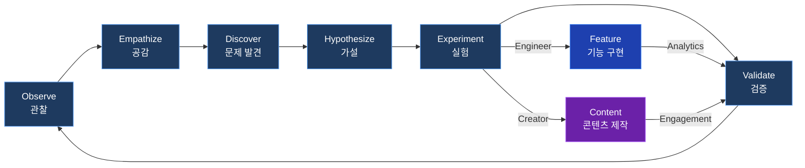
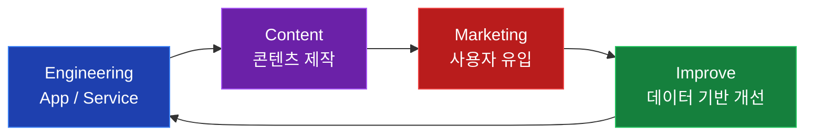

<h1 align="center">PROBLEM SOLVER</h1>

<p align="center">
  
  
  
</p>

<p align="center">
  <b>관찰하고, 공감하고, 문제를 발견하고, 가설을 세워 실험하고, 검증하며 개선한다.</b><br/>
  기능을 만들어 문제를 해결하는 <b>Engineer</b>, 콘텐츠로 문제를 해결하는 <b>Creator</b>.<br/>
  둘이 합쳐질 때, <b>Founder</b>가 된다.
</p>

---

## Same Root, Different Fruits

Engineer와 Creator는 같은 사이클로 돌아간다. 차이는 실험의 매체와 검증의 방법뿐이다.



---

<table>
<tr>
<td width="50%" valign="top">

### Engineer

기능을 만들어 문제를 해결한다. 가설을 코드로 구현하고, 데이터로 검증한다.

| Service | Description |
|---------|-------------|
| **챙겨콘** | 기프티콘 관리 앱 (만료일 자동 파싱 + 알람) |
| **아이담다** | AI 아이 사진 정리 앱 (그룹핑, 표정 분석) |
| **로보펫** | AIOT 반려견 화장실 |
| **bethany-mall** | 온라인 서점 쇼핑몰 |
| **bookey** | 출판사 ERP 시스템 |

</td>
<td width="50%" valign="top">

### Creator

콘텐츠를 만들어 문제를 해결한다. 가설을 콘텐츠로 실험하고, 반응으로 검증한다.

| Channel | Focus |
|---------|-------|
| **LinkedIn** | 인사이트 & 경험 공유 |
| **YouTube - Boaz** | 기술/철학 주제 영상 |
| **YouTube - Bethany** | 일상/라이프 영상 |
| **P.E.C. Article** | 커뮤니티 아티클 |

<br/>

> *앞으로 엔지니어가 가야 할 방향은 사용자 중심, 프로덕트 중심의 가치 전달이다.*

</td>
</tr>
</table>

---

## P.E.C. — Product Engineer Community

Engineer와 Creator가 자연스럽게 합쳐지는 교집합.

<p align="center">
  
  
  
</p>

기능을 만드는 과정에서 생긴 경험과 노하우가 교육 콘텐츠가 되고,
그 콘텐츠가 다시 커뮤니티를 통해 사람들의 문제를 해결하는 구조.

---

## Founder Agent — Vision

**기능 구현 과정에서 얻은 경험, 노하우, 교훈이 콘텐츠의 소재가 된다.**
이 선순환을 AI 에이전트가 함께 돌려주는 것이 최종 비전이다.

### Flywheel



### Agent Evolution Roadmap

```
 Stage 1                    Stage 2                         Stage 3
 ─────────────────────────────────────────────────────────────────────

 Creator Agent              Creator + Marketing Agent   ──► Creator-Founder Agent
 (콘텐츠 실행 보조)           (실행 + 검증 자동화)            (자율 사이클)

 Engineer Agent             Engineer + Marketing Agent  ──► App-Founder Agent
 (기능 구현 보조)             (실행 + 검증 자동화)            (자율 사이클)

 ─────────────────────────────────────────────────────────────────────
 실행만 돕는다               검증이 합쳐진다                How를 자동화한다
                                                         Why는 사람이 결정한다
```

---

## Tech Stack

<p align="center">
  
  
  
  
  
</p>

---

<p align="center">
  
</p>

<p align="center">
  <a href="https://www.linkedin.com/in/boaz-hwang"></a>
  <a href="https://productengineer.info"></a>
</p>

<p align="center">
  <b>Integrity · Devotion · Improve</b>
</p>
